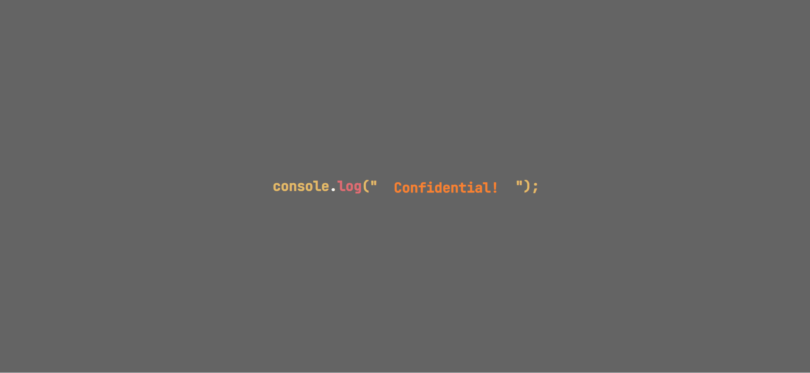

# CONSOLE FINANCES

## Description

This project utilises the concepts and skills learned in JavaScript fundamentals in order to analyse the financial records of a company using the dataset provided. Skills used include variables, for loops, functions, nested arrays, and conditional logic.

### Built With

## Getting Started

You can view the deployed project via [here](https://skechekar.github.io/console-finances) hosted on GitHub Pages. 

### Usage

Chrome DevTools can be brought up using *Command+Option+I* on macOS or *Ctrl+Shift+I* on Windows, or by right clicking anywhere on the page and clicking Inspect, and then navigating to the Console tab where you will be able to see the financial records analysis output.

## Credits

[SkillIcons](https://skillicons.dev/) for the JavaScript and HTML5 icons used in the README

MDN Web Docs used for [push()](https://developer.mozilla.org/en-US/docs/Web/JavaScript/Reference/Global_Objects/Array/push), [reduce()](https://developer.mozilla.org/en-US/docs/Web/JavaScript/Reference/Global_Objects/Array/reduce), [indexOf()](https://developer.mozilla.org/en-US/docs/Web/JavaScript/Reference/Global_Objects/Array/indexOf),  [Math.max()](https://developer.mozilla.org/en-US/docs/Web/JavaScript/Reference/Global_Objects/Math/max), and [toFixed()](https://developer.mozilla.org/en-US/docs/Web/JavaScript/Reference/Global_Objects/Number/toFixed)

[Intro to Reduce](https://www.youtube.com/watch?v=XKD0aIA3-yM&list=PLo63gcFIe8o0nnhu0F-PpsTc8nkhNe9yu) tutorial used to help understand the reduce() function

[Pokecoder](https://codepen.io/pokecoder/pens/) for the CSS animation

## License

Licensed under the [MIT](/LICENSE) license.
